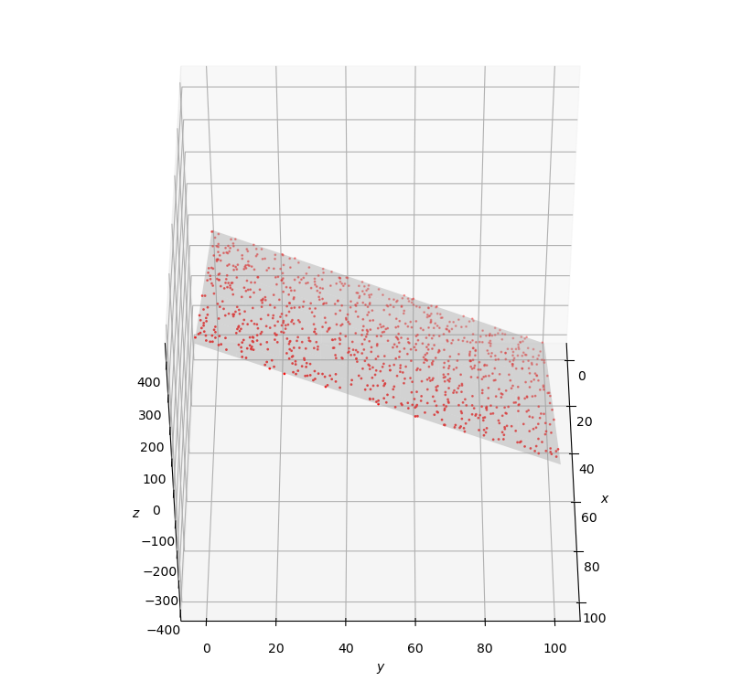

# 实验报告

使用的库：

- numpy
- csv
- pathlib
- math  (这个实际没咋用到)

最终的训练得到的函数以及可视化图像：
z= 4.021290227979238x + 4.021290227979238y + 4.310284011920089



使用线性回归方法，前期由于没有进行数据标准化，在训练过程中loss死活下降缓慢
之后直接好多了，这从我们之前写的main()中的注释可以看到
```
#经过第一次迭代后的值  a=1,b=1,c=0 loos=13.651262268662906
#经过第二次迭代后的值  a=395.3620899561479
                    #b=-373.9789681172605
                    #c=27.58882723274058  loss=1.0906218830518108
#经过第三次迭代后的值  a=401.9158795062455
                    #b=-376.35246212932987
                    #c=29.887500814868403  loss=1.0533662679415212
```

同时这次没有写类，很后悔，下一次作业应该不会这样了，没有类管理起来真的很麻烦。


