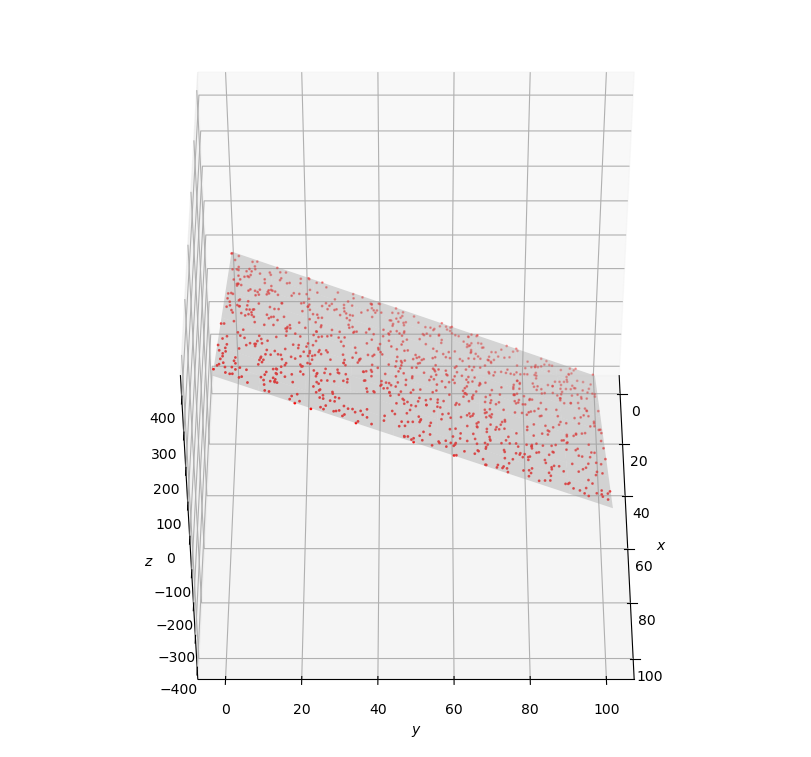

# 汇总报告

> 这是汇总了easy和medium难度的实验报告

## 线性回归实验报告

### 要求：

给定含有1000条记录的数据集`mlm.csv`，其中每条记录均包含两个自变量`x`,`y`和一个因变量`z`，它们之间存在较为明显的线性关系。

**任务：请对数据进行三维可视化分析，并训练出良好的线性回归模型。**

### 准备工作：

**使用的库：**

- numpy
- csv
- pathlib
- math  (这个实际没咋用到)

```python
import csv
import numpy as np
from pathlib import Path
import math
import matplotlib.pyplot as plt
from mpl_toolkits.mplot3d import Axes3D
```

###部分的代码：

**主函数：**

```python
if __name__ == "__main__":
    data,lable=init_data() #返回list
    data,lable= read_data(data,lable)#返回numpy对象
    data_new,data_norm,lable_new,lable_m,lable_min=normalize(data,lable)#数据标准化
    w,b=train(data_new,lable_new)#训练
    w,b=denormalizeweightsBias(w,b,data_norm)#还原参数值
    #差点东西 训练的还是调参的 呜呜呜
    w1,w2,b=test(data,lable,w,b,1,lable_m,lable_min)#测试 以及 输出最终模型
    Model_visualization(w1,w2,b)#模型可视化
```

**初始化数据模块：**

```python
def init_data():
    path="Dataset/mlm.csv" 
    csv_file=open(path,'r')
    xyz_set=csv.reader(csv_file)
    data=[]
    z_ls=[]
    k=0 
    pass
    for x,y,z in xyz_set:
        if k==0:
            k=1
            continue
        data.append([float(x),float(y)])
        z_ls.append(float(z))

    return data,z_ls
```

**标准化模块：**

```python
def normalize(data,lable):  #max-min标准化
    data_new=np.zeros(data.shape)
    feature_nm=data.shape[1]
    data_norm=np.zeros((data.shape[1],2))
    #lable标准化
    lable_new=np.zeros((feature_nm,1))
    lable_max=np.max(lable)
    lable_min=np.min(lable)
    lable_m=lable_max-lable_min
    lable_new=(lable-lable_min)/lable_m
    #标准化data
    for i in range(feature_nm):
        col_i=data[:,i]
        data_max=np.max(col_i)
        data_min=np.min(col_i)
        data_norm[i,0]=data_min
        data_norm[i,1]=data_max-data_min
        data_new[:,i]=(col_i-data_min)/data_norm[i,1]
    return data_new,data_norm,lable_new,lable_m,lable_min
```

**训练模块：**

```python
def train(data,lable):
    input_sz=2
    output_sz=1
    eps=0.1
    eta=0.001
    batch_size=5
    max_epoch=5000
    train_num=1000
    #第一次训练
    w=np.zeros((input_sz,output_sz))
    b=np.zeros((1,output_sz))
    
    max_iteration= math.ceil(train_num/batch_size)
    checkpoint=0.1 #检查点
    checkpoint_iteration = (int)(max_iteration * checkpoint)
    for epoch in range(max_epoch):
        for iteration in range(max_iteration):
            start=iteration*batch_size
            end=start+batch_size
            batch_x=data[start:end,:]  #data
            batch_y=lable[start:end:] #lable   淦哦 特殊情况
            batch_z=np.dot(batch_x,w)+b     #预测值
            #backwardBatch
            dz= batch_z - batch_y
            dw= np.dot(batch_x.T,dz)/batch_size
            db= dz.sum()/batch_size
            w-= dw*eta
            b-= db*eta
            
            total_iteration = epoch * max_iteration + iteration
            if (total_iteration+1) % checkpoint_iteration == 0:
                loss=((np.dot(data,w)+b)- lable)**2
                Loss=loss.sum()/1000/ 2 
                #print(f'dz={dz},loss={Loss} b={b}')
                #print(db)
    return w,b
```

**可视化模块：**

```python
def Model_visualization(w1,w2,b):
    x = np.linspace(0, 100, 10)
    y = np.linspace(0, 100, 10)
    x_mesh, y_mesh = np.meshgrid(x, y, indexing='ij')
    z_mesh = w1 * x_mesh + w2 * y_mesh + b   # 拟合平面方程
    path="Dataset/mlm.csv"

    fig = plt.figure(figsize=(10, 10))
    sub = fig.add_subplot(111, projection='3d')
    sub.plot_surface(x_mesh, y_mesh, z_mesh, color='0.999', alpha=0.4)  # 绘制平面方程
    sub.set_xlabel(r'$x$')
    sub.set_ylabel(r'$y$')
    sub.set_zlabel(r'$z$')
    sub.view_init(elev=45, azim=0)  # 初始观看角度
    x1, y1, z1 = np.loadtxt(path, delimiter=',', skiprows=1, usecols=(0, 1, 2), unpack=True)
    # 导入数据
    sub.scatter(x1, y1, z1, color='r', s=1)  # 绘制散点图
    plt.show()
```

###结果

最终的训练得到的函数以及可视化图像：
z= 4.021290227979238x + 4.021290227979238y + 4.310284011920089




使用线性回归方法，前期由于没有进行数据标准化，在训练过程中loss死活下降缓慢
之后直接好多了，这从我们之前写的main()中的注释可以看到

```
#经过第一次迭代后的值  a=1,b=1,c=0 loos=13.651262268662906
#经过第二次迭代后的值  a=395.3620899561479
                    #b=-373.9789681172605
                    #c=27.58882723274058  loss=1.0906218830518108
#经过第三次迭代后的值  a=401.9158795062455
                    #b=-376.35246212932987
                    #c=29.887500814868403  loss=1.0533662679415212
```

## 非线性多分类实验报告

### 要求：

鸢尾花数据集`iris.csv`含有150条记录，每条记录包含萼片长度`sepal length`、萼片宽度`sepal width`、 花瓣长度`petal length`和花瓣宽度`petal width`四个数值型特征，以及它的所属类别`class`（可能为`Iris-setosa`,`Iris-versicolor`,`Iris-virginica`三者之一）。

**任务：请利用该数据集训练出一个良好的非线性分类器。**

###准备工作

**使用的库**:

```python
import numpy as np 
import math
from enum import Enum
import matplotlib.pyplot as plt
import os
from pathlib import Path
```

### 部分的代码

主函数：

```python
if __name__ == "__main__":
    url="Dataset/iris.csv"
    data=reader(url)
    data.read_csv_data()
    data.normalize_y(NetType.MultipleClassifier, base=1) 
    
    #fig= plt.figure(figsize=(6,6))
    data.normalize_x() 
    #data.shuffle()
    data.GenerateValidationSet()  
    n_input= data.num_feature
    n_ouput= data.num_category
    n_hidden=3  
    eta,batch_sz,max_epoch=0.1,20,5000
    eps=3
    hp=HyperParameters(n_input,n_ouput,n_hidden,eta,max_epoch,batch_sz,eps,
    NetType.MultipleClassifier, InitialMethod.Xavier)
    net= NeuralNet(hp,"I_don't_know")   
    net.load_result() 
    net.train(data,100,True)
```

读取csv文件：

```python
def read_csv_data(self):  #质检合格
        #file=csv.reader(self.path)
        data= np.loadtxt(self.path,delimiter=",",dtype="str",skiprows=1)
        #默认情况下，数据被认为是float类型，因此，我全转str
        self.xraw=data[:,:-1].astype("float")
        self.yraw=data[:,-1:]
        self.xtrain=self.xraw
        self.ytrain=self.yraw
        self.num_train=self.xtrain.shape[0]
        self.num_feature=self.xtrain.shape[1]
        self.num_category=len(np.unique(self.ytrain))#unique挺好用,下面这个就可以注释掉了
        self.label_dict={"Iris-setosa":0,"Iris-versicolor":1,"Iris-virginica":2}
        #好家伙，我自己分训练集
        self.test_head=int(self.num_train/4)
        self.test_end=int(self.num_train/2)
        self.xtest_raw=self.xraw[self.test_head:self.test_end,:]
        self.ytest_raw=self.yraw[self.test_head:self.test_end,:]
        self.xtest=self.xtest_raw
        self.ytest=self.ytest_raw
```

标准化：

```python
def __normalize_train_x(self,raw_data):
        x_new=np.zeros_like(raw_data)
        self.x_norm = np.zeros((2,self.num_feature))
        for i in range(self.num_feature):
            x=raw_data[:,i]  
            max_v=np.max(x)
            min_v=np.min(x)
            self.x_norm[0,i]=min_v
            self.x_norm[1,i]=max_v-min_v
            x_new[:,i]= (x - self.x_norm[0,i])/self.x_norm[1,i]
        return x_new
    def normalize_x(self):
        x_merge= np.vstack((self.xraw,self.xtest_raw))
        x_merge_norm= self.__normalize_train_x(x_merge)
        train_count= self.xraw.shape[0]
        self.xtrain= x_merge_norm[:train_count,:]
        self.xtest= x_merge_norm[train_count:,:]

    def normalize_y(self,type,base=0):
        if type == NetType.Fitting:
            y_merge = np.vstack((self.YTrainRaw, self.YTestRaw))
            y_merge_norm = self.__NormalizeY(y_merge)
            train_count = self.YTrainRaw.shape[0]
            self.YTrain = y_merge_norm[0:train_count,:]
            self.YTest = y_merge_norm[train_count:,:]                
        elif type == NetType.BinaryClassifier:
            self.YTrain = self.__ToZeroOne(self.YTrainRaw, base)
            self.YTest = self.__ToZeroOne(self.YTestRaw, base)
        if type == NetType.MultipleClassifier:  
            #我们这次重点关注 类型为MultipleClassifier的类型
            self.ytrain = self.__To_onehot(self.yraw, base)
            self.ytest = self.__To_onehot(self.ytest_raw, base)
    def normalize_predictdata(self,x_p): #尺度问题————待解决
        x_new_p=np.zeros(x_p.shape)
        for i in range(x_p.shape[1]):
            x_new_p[:,i]=(x_p[:,i]-self.x_norm[i,0])/self.x_norm[i,1]
        return x_new_p
        
    def __To_onehot(self,Y,base=0):
        count=Y.shape[0]
        y_new= np.zeros((count,self.num_category))
        for i in range(count):
            n=self.label_dict[Y[i,0]]
            y_new[i,base-n]=1
        return y_new
```

softmax:

```python
class softmax(object):
    def forward(self,z):
        shift_z= z-np.max(z,axis=1,keepdims=True)
        exp_z=np.exp(shift_z)
        a= exp_z/np.sum(exp_z,axis=1,keepdims=True)
        return a 
```

超参类：

```python
class HyperParameters(object):  #超参
    def __init__(self,n_input,n_output,n_hidden,eta=0.1,max_epoch=10000,batch_sz=5,
    eps=0.1,net_type=NetType.Fitting,init_method= InitialMethod.Xavier):
        self.num_input = n_input
        self.num_hidden = n_hidden
        self.num_output = n_output
        self.eta = eta
        self.max_epoch = max_epoch

        self.batch_sz = batch_sz
        self.net_type = net_type
        self.init_method = init_method
        self.eps = eps
```

神经网络类：

```python
class NeuralNet(object):
    def __init__(self,hp,nm):
        self.hp=hp
        self.model_name=nm
        self.subfolder=os.getcwd()+"\\"+self.__create_subfloder()
        #print(self.subfolder)  打印路径

        #self.w=np.zeros((self.hp.n_input,self.hp.n_output))
        #self.b=np.zeros((1,self.hp.n_output))

        self.wb1=WB(self.hp.num_input, self.hp.num_hidden, self.hp.init_method, self.hp.eta)
        self.wb1.init_w(self.subfolder, False)
        self.wb2=WB(self.hp.num_hidden, self.hp.num_output, self.hp.init_method, self.hp.eta)
        self.wb2.init_w(self.subfolder, False)

```

正向传播：

```python
def forward(self,batch_x):
        self.z1= np.dot(batch_x,self.wb1.w)+self.wb1.b #计算z1
        self.a1= Sigmoid().forward(self.z1) #计算a1
        self.z2= np.dot(self.a1,self.wb2.w)+self.wb2.b  #计算z2
        if self.hp.net_type ==NetType.BinaryClassifier:
            print("哈哈哈哈我没做二元分类")
        elif self.hp.net_type ==NetType.MultipleClassifier:
            self.a2= softmax().forward(self.z2) 
        else:
            self.a2= self.z2
        self.output= self.a2 #最终输出
```

反向传播:

```python
def backward(self,batch_x,batch_y,batch_a): #这个要注意
        m= batch_x.shape[0] #样本个数  
        dz2=self.a2-batch_y
        self.wb2.dw= np.dot(self.a1.T,dz2)#除以m防止梯度爆炸
        self.wb2.db= np.sum(dz2,axis=0, keepdims=True)/m
        #对于多样本计算，需要在横轴上做sum，得到平均值
        d1= np.dot(dz2, self.wb2.w.T)
        dz1,_ = Sigmoid().backward(None, self.a1, d1) #?????
        self.wb1.dw= np.dot(batch_x.T, dz1)/m
        self.wb1.db= np.sum(dz1)/m
```

训练：

```python
def train(self,dataread,checkpoint,need_test): #分类训练
        self.loss_trace= train_history() #历史记录
        self.loss_func= loss_func(self.hp.net_type) #loss对象
        if self.hp.batch_sz==-1:
            self.hp.batch_sz = dataread.num_train
        max_iteration= math.ceil(dataread.num_train/self.hp.batch_sz) #最大迭代数
        checkpoint_iteration= int(max_iteration*checkpoint)
        for epoch in range(self.hp.max_epoch):
            #dataread.shuffle()
            for iteration in range(max_iteration):
                batch_x,batch_y=dataread.get_batch_train(self.hp.batch_sz,iteration)
                batch_a= self.forward(batch_x)
                #正向传播结束
                self.backward(batch_x,batch_y,batch_a)
                #反向传播结束()
                self.updata()# 
                total_iteration = epoch * max_iteration + iteration #计算迭代数                
                if (total_iteration+1)% checkpoint_iteration == 0:
                    self.checkloss(dataread,batch_x,batch_y,epoch,total_iteration)
        self.save_result()
        print("end")
    def forward(self,batch_x):
        self.z1= np.dot(batch_x,self.wb1.w)+self.wb1.b #计算z1
        self.a1= Sigmoid().forward(self.z1) #计算a1
        self.z2= np.dot(self.a1,self.wb2.w)+self.wb2.b  #计算z2
        if self.hp.net_type ==NetType.BinaryClassifier:
            print("哈哈哈哈我没做二元分类")
        elif self.hp.net_type ==NetType.MultipleClassifier:
            self.a2= softmax().forward(self.z2) 
        else:
            self.a2= self.z2
        self.output= self.a2 #最终输出
```

检查loss:

```python
def checkloss(self,datareader,train_x,train_y,epoch,total_iteration):
        print(f"epoch={epoch}, total_iteration={total_iteration}")
        self.forward(train_x)
        #计算损失
        loss_train= self.loss_func.checkloss(self.output,train_y)
        accuracy_train= self.__cal_accuracy(self.output,train_y)
        print("loss_train=%.6f, accuracy_train=%f" %(loss_train, accuracy_train))
        #验证损失
        yld_x,yld_y= datareader.GetValidationSet()
        self.forward(yld_x)
        loss_vld= self.loss_func.checkloss(self.output,yld_y)
        accuracy_vld= self.__cal_accuracy(self.output,yld_y)
        print("loss_valid=%.6f, accuracy_valid=%f" %(loss_vld, accuracy_vld))        
        print(f"loss = {loss_train}")
```

###实验结果

> 取了最后几次输出

```
......
loss = 0.037846634541078165
epoch=4599, total_iteration=32199
loss_train=0.037848, accuracy_train=1.000000
loss_valid=0.000179, accuracy_valid=1.000000
loss = 0.03784836217818403
epoch=4699, total_iteration=32899
loss_train=0.037850, accuracy_train=1.000000
loss_valid=0.000179, accuracy_valid=1.000000
loss = 0.03785007469182558
epoch=4799, total_iteration=33599
loss_train=0.037852, accuracy_train=1.000000
loss_valid=0.000179, accuracy_valid=1.000000
loss = 0.037851772317203346
epoch=4899, total_iteration=34299
loss_train=0.037853, accuracy_train=1.000000
loss_valid=0.000178, accuracy_valid=1.000000
loss = 0.03785345528533328
epoch=4999, total_iteration=34999
loss_train=0.037855, accuracy_train=1.000000
loss_valid=0.000178, accuracy_valid=1.000000
loss = 0.03785512382312461
```

